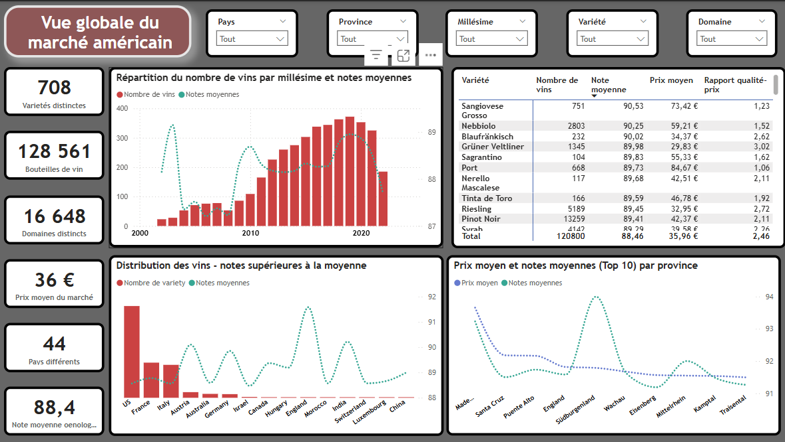
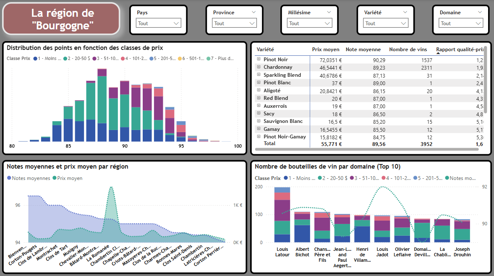
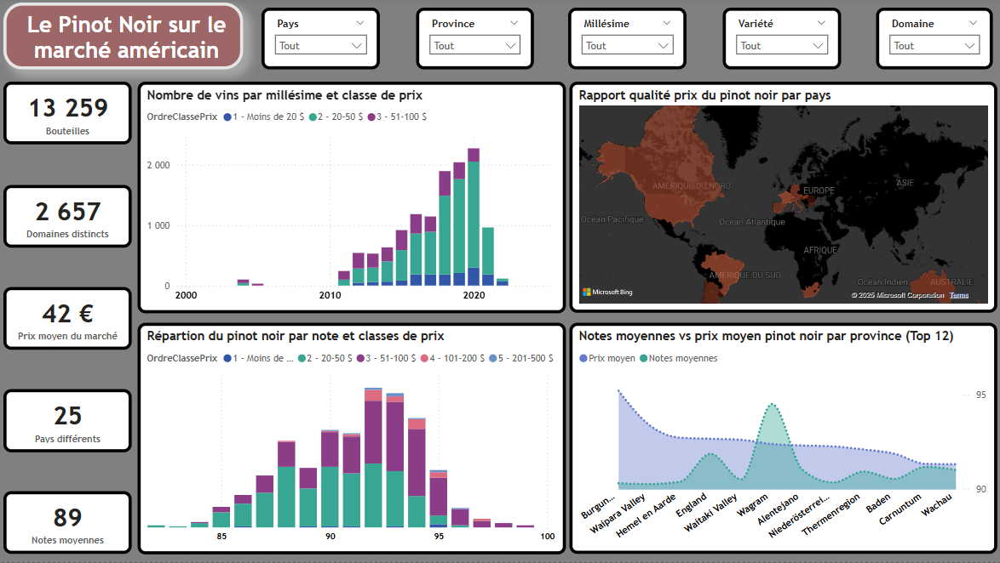

# 1. Contexte

Le Domaine des Croix, producteur de vins en Bourgogne, souhaite se lancer sur le marché américain. Afin d'adopter une stratégie de prix compétitive, l'entreprise souhaite analyser le marché du vin aux États-Unis et définir un prix optimal pour ses bouteilles. 

# 2. Problématique

Comment fixer un prix compétitif pour les vins du Domaine des Croix sur le marché américain en tenant compte des tendances du marché, de la concurrence et des attentes des consommateurs ? 

# 3. Objectifs

* Analyser le marché du vin aux États-Unis.

* Comparer les vins du Domaine des Croix avec leurs concurrents.

* Déterminer une stratégie de prix alignée sur le positionnement souhaité.

* Présenter les résultats sous une forme compréhensible et accessible.

# 4. Jeux de données

Le projet repose sur deux jeux de données :

* **Dataset principal** : **130 000** bouteilles de vin avec cépages, pays, régions, millésimes, notes d'œnologues, descriptifs et prix moyens en dollars. [Lien du dataset](https://github.com/WildCodeSchool/wilddata/raw/main/wine.zip)

* **Dataset spécifique** : Vin du Domaine des Croix à analyser. 
[Lien du dataset](https://raw.githubusercontent.com/WildCodeSchool/wilddata/main/domaine_des_croix.csv) 

# 5. Méthodologie et outils

L’analyse du marché se fera à travers plusieurs étapes :

* **Préparation et exploration des données** : Nettoyage, structuration et premières analyses. 

* **Analyse du marché** : Visualisation de la répartition des vins par pays, analyse des notes par cépage, comparaison des prix, etc. 

* **Analyse comparative** : Étude détaillée des vins concurrents, en affinant l’analyse des vins français, bourguignons et Pinot Noir. 

* **Recommandation de prix** : 
    * ***Une fourchette de prix*** en fonction du positionnement souhaité (entrée de gamme, premium, etc.). 
    * ***Prédiction d'un prix optimal*** d'entrée sur le marché en fonction des caractéristiques les plus pertinentes.

* **Présentation des résultats** : Création d’un tableau de bord interactif et accessible, illustrant les analyses et recommandations. 

Les outils utilisés pour cette analyse inclueront des bibliothèques de visualisation de données comme Seaborn et Plotly, ainsi que des solutions de BI comme Power BI.  

Vous trouverez le fichier ayant servi à l'exploration et le traitement des données [ici](https://github.com/Diaure/Pinot-Noir-Domaine-des-Croix/blob/main/Notebook/Nettoyage_de_donn%C3%A9es.ipynb). 

# 6. Livrables attendus

* Une présentation claire et vulgarisée pour expliquer la démarche et les résultats au client non expert en data.

* Un tableau de bord interactif

 

 

# 7. Stratégie de Prix et Prédiction

Afin d’optimiser le positionnement du Domaine des Croix sur le marché américain, trois gammes de prix ont été définies :

* **Entrée de gamme (75$ - 150$)** : Positionnement pour entrer sur le marché, basé sur l’analyse des prix des vins similaires. 

* **Gamme intermédiaire (150$ - 300$)** : Ciblant un positionnement compétitif pour un public amateur averti. 

* **Gamme premium (300$ et plus)** : Alignement avec les vins haut de gamme et d’exception. 

Une **modélisation prédictive** a été réalisée pour estimer le ***prix optimal*** du vin du Domaine des Croix en fonction des caractéristiques du marché (cépage, millésime, notes des œnologues, etc.). 

Le modèle nous a permis de prédire un **prix optimal de 98,84$**, ce qui positionne le vin dans la gamme d’entrée de marché (**75$ - 150$**). Ce prix représenterait une stratégie prix d'entrée sur le marché américain et évolutive selon le besoin du client. 

Cette prédiction est mise en perspective avec les tendances du marché et les stratégies concurrentielles, permettant au Domaine des Croix d'ajuster son prix en fonction de son objectif de positionnement. 

[Présentation complète des résultats](https://docs.google.com/presentation/d/1dYb7lT9FxvQj0Ay8Qtd2zGZXRJKUP7-t/edit?usp=sharing&ouid=117204650817277658970&rtpof=true&sd=true) 
[Dashboard](https://github.com/Diaure/Pinot-Noir-Domaine-des-Croix/blob/main/Dashboards/Strat%C3%A9gie_prix_Domaine-des-Croix_.pbix) 

# 8. Conclusion

Ce projet vise à fournir au Domaine des Croix une analyse approfondie du marché du vin aux États-Unis et une recommandation de prix adaptée à son positionnement. Grâce à des visualisations interactives et une approche pédagogique, le client pourra comprendre les dynamiques du marché et définir une stratégie de prix optimale.
